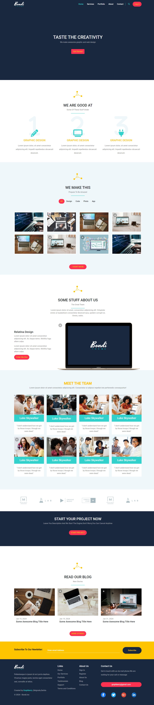

# Bootstrap-Bonndi-Template

<h1 align="center" id="title">Bondi Website</h1>

This is a website for Bondi a creative agency. The website showcases the agency's services portfolio team and blog. It is built using HTML CSS Bootstrap and JavaScript

<h2>🚀 Demo</h2>

[Live Demo Here👉🏻♥️](https://eng-ahmed-hussien.github.io/Bootstrap-Bonndi-Template/)

<h2>Project Screenshots:</h2>

  
  
<h2>🧐 Features</h2>

Here're some of the project's best features:

*   Navigation bar with links to different sections of the website\* Landing page with a call-to-action button
*   Features section highlighting the agency's areas of expertise
*   Portfolio section displaying the agency's work
*   About section with information about the team
*   Team section introducing the agency's members
*   technologies section showcasing the technologies used by the agency.
*   Project section encouraging users to start their project
*   Blog section displaying the latest news and stories
*   Subscribe section for users to sign up for the agency's newsletter
*   Footer with links to different sections of the website social media icons and contact information

  
  
<h2>💻 Built with</h2>

Technologies used in the project:

*   Html 5.
*   Css3. 
*   Bootstrap 5.3.
*   Font Awesome.
*   Google Fonts.

<h2> 📧Contact</h2>

For any questions or inquiries, please contact 
             [My WhatsApp 💬](https://wa.me/201098909476)
